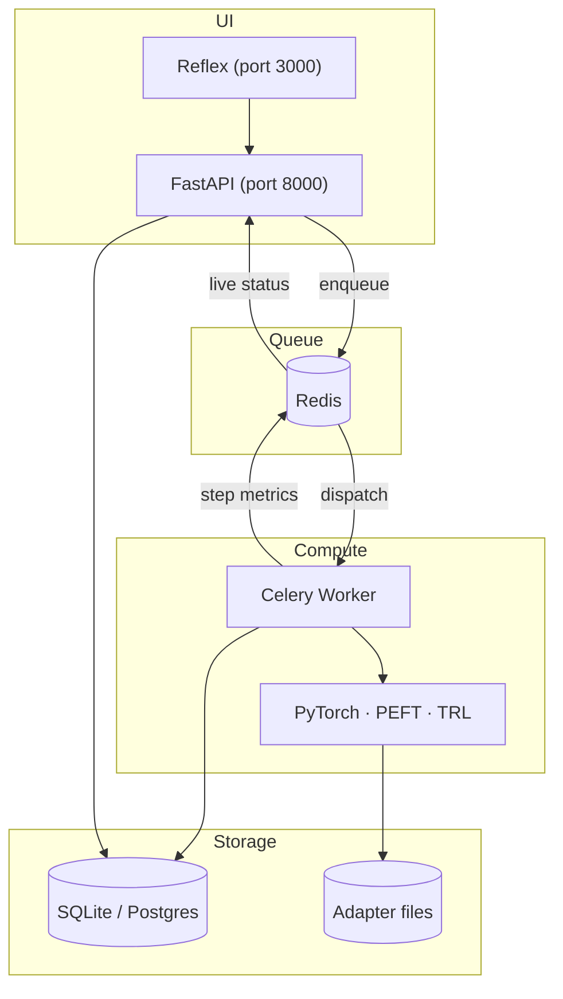

# TuneOS

[](https://github.com/SahilKumar75/TuneOS/actions/workflows/ci.yml)
[](https://github.com/SahilKumar75/TuneOS/actions/workflows/release.yml)
[](LICENSE)
[](https://www.python.org/)
[](https://github.com/astral-sh/ruff)

TuneOS is an open-source fine-tuning workstation for large language models. You bring a model and a dataset; TuneOS handles the rest — from dataset prep through training, evaluation, and pushing the adapter to the Hub. All compute runs on infrastructure you control.

It runs as a native macOS app (PyQt6 shell that manages its own Redis and worker) or as two Docker containers you can deploy on Hugging Face Spaces.

## What's in this release

The wizard now supports three training paths: supervised fine-tuning, DPO preference alignment, and knowledge distillation. Pick the mode in step 1 and the wizard adapts — step 3 shows the right dataset uploader, step 4 shows the right config fields. Vision-language model fine-tuning (`POST /api/jobs/vision`) is also live, backed by `AutoProcessor` for image-text datasets.

On the adapter side, six techniques are now registered in `trainer/adapters.py` (lora, qlora, adalora, ia3, prefix, prompt) and selectable per run. Advanced mode adds an adapter composition section where you can stack a second technique on top of the trained model via `PeftMixedModel`.

Under the hood: Celery queues split into `sft`, `dpo`, and `kd` for independent scaling, structured JSON logging throughout, and a three-level state hierarchy (`FinetuneState` → `TrainingPollerState` → `DeployState`) that keeps wizard config, training runtime, and deploy actions cleanly separated.

## How it works

The UI submits jobs to a Redis queue. A Celery worker picks them up and runs the training stack. Progress streams back to the UI in real time. Same flow whether you're on a laptop or across two HF Spaces.



Jobs go through a simple state machine: `queued → running → completed / failed`. The worker writes status to both Redis (live polling) and SQLite (durable fallback), so job history survives a Redis restart.

## Getting started

You need Python 3.10+, Poetry, and Docker Desktop.

```bash
git clone https://github.com/SahilKumar75/TuneOS
cd TuneOS
cp .env.example .env        # add HF_TOKEN for gated models
poetry install
docker compose up -d        # starts Redis + Celery worker
poetry run reflex run
```

Open `http://localhost:3000`. For your first run, try `EleutherAI/pythia-410m` — it's small enough to train on CPU and the whole pipeline finishes in a few minutes.

No Docker? Start Redis and the worker manually:

```bash
redis-server &
celery -A workers.celery_app worker --loglevel=info
```

### Desktop app (macOS)

```bash
poetry install --with desktop
poetry run python build_desktop.py
open dist/TuneOS.app
```

The shell starts everything automatically. Windows and Linux packaging is on the roadmap.

### Deploying to Hugging Face Spaces

Two Spaces (App + Worker) connected by Upstash Redis. See [docs/deploy.md](docs/deploy.md) for the step-by-step.

## Supported models

Any Hugging Face causal LM works — `target_modules` are auto-detected per architecture. These are the ones with known-good defaults:

| Model | Hub ID | VRAM (QLoRA) |
|---|---|---|
| Mistral 7B | `mistralai/Mistral-7B-v0.1` | ~16 GB |
| Llama 3 8B | `meta-llama/Meta-Llama-3-8B` | ~18 GB (gated) |
| Phi-3 Mini | `microsoft/Phi-3-mini-4k-instruct` | ~8 GB |
| Gemma 2B | `google/gemma-2b` | ~6 GB |
| Pythia 410M | `EleutherAI/pythia-410m` | ~2 GB |

Auto-detection covers Mistral, Llama, Gemma, Phi-3, Phi-4, Falcon, Qwen2/3, GPT-NeoX, StarCoder2, Mixtral, and more.

## Stack

Reflex + FastAPI on the frontend, Celery + Redis for the job queue, PyTorch + PEFT + TRL + bitsandbytes for training. Experiment history goes to SQLite by default; set `EXPERIMENTS_DB_URL` to a Postgres DSN for multi-worker deployments.

## Project layout

```
app/
  state/          FinetuneState, TrainingPollerState, DeployState
  components/     Wizard step components, loss chart, dataset uploader
trainer/
  adapters.py     Strategy registry + stack_adapter()
  finetune.py     SFT pipeline
  dpo.py          DPO pipeline
  vision_finetune.py  VLM pipeline
  metrics.py      Perplexity, ROUGE, BLEU, METEOR registry
workers/
  train_task.py   SFT task (sft queue)
  dpo_task.py     DPO task (dpo queue)
  vision_task.py  VLM task
docs/             api-reference, architecture, deploy, testing, and more
tests/
```

## Tests

```bash
poetry run pytest
poetry run ruff check .
poetry run ruff format --check .
```

The trainer integration test (real GPU, real model) is opt-in: `TUNEOS_INTEGRATION_TESTS=1 pytest tests/test_trainer_integration.py`.

## Contributing

See [CONTRIBUTING.md](.github/CONTRIBUTING.md). Security issues go to [SECURITY.md](.github/SECURITY.md). Apache 2.0 license.
