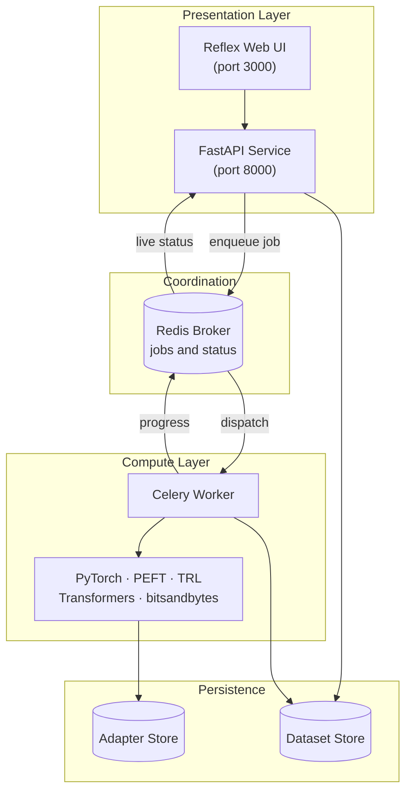
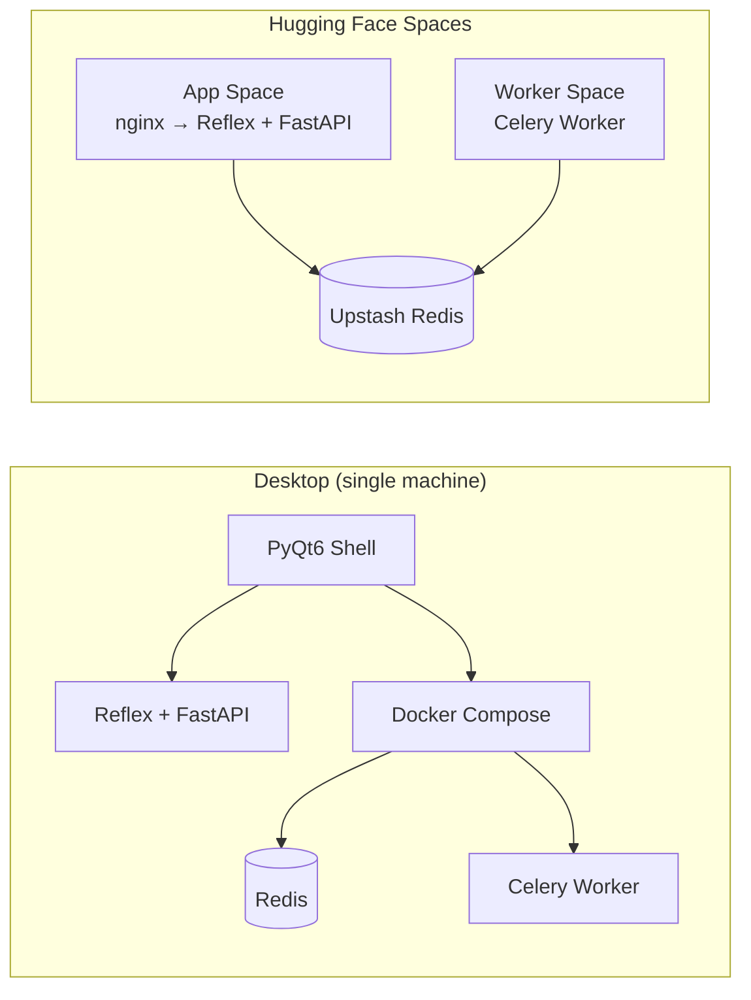
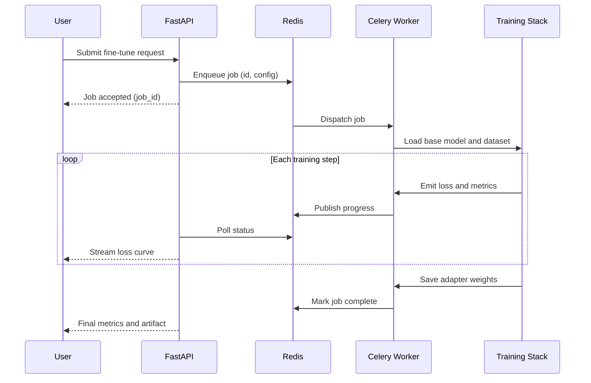
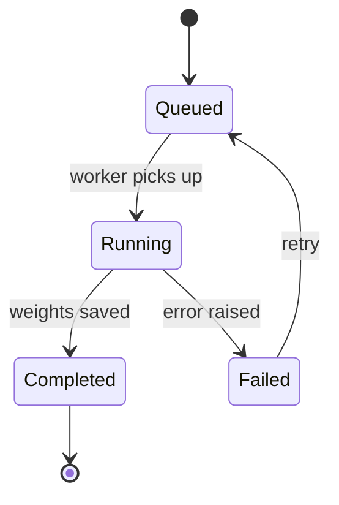

# TuneOS

[](https://github.com/SahilKumar75/TuneOS/actions/workflows/ci.yml)
[](https://github.com/SahilKumar75/TuneOS/actions/workflows/release.yml)
[](LICENSE)
[](https://www.python.org/)
[](https://github.com/astral-sh/ruff)

TuneOS is an open-source workstation for the full lifecycle of Large Language Models.
It provides a single interface for fine-tuning, dataset preparation, format conversion,
and model analysis, with all training executed on infrastructure you control.

The application ships in two forms from one codebase:

- A **native desktop application** (PyQt6 shell) that orchestrates its own background services.
- A **containerized web deployment** that runs on Hugging Face Spaces or any Docker host.

---

## What's New

- **7-step fine-tuning wizard** — a guided end-to-end flow from model selection through dataset, technique (LoRA/QLoRA), hyperparameters, live training, and deployment. Opens as a first-class workspace tab.
- **Experiment tracking** — every training run is recorded in a local SQLite database (`storage/experiments.db`). Run history, hyperparameters, loss curves, and final metrics persist across restarts and are browsable in the Experiments view.
- **Deploy tab** — after training completes, step 7 provides one-click actions: download the adapter weights, push to Hugging Face Hub, export to GGUF for local inference engines, push to a GitHub repository, and test the model in a built-in chat interface.

---

## Capabilities

| Domain | Description |
| --- | --- |
| Parameter-efficient fine-tuning | LoRA and QLoRA training via PyTorch, PEFT, and TRL, executed locally or on a dedicated worker. |
| Dataset preparation | Generate, format, and validate instruction and chat datasets prior to training. |
| Model conversion | Convert weights between Hugging Face, SafeTensors, and GGUF formats for downstream inference engines. |
| Training analysis | Track loss curves, evaluation metrics, and run history in real time. |
| Experiment tracking | Persist every fine-tuning run (hyperparameters, loss history, metrics) in a local SQLite database, with comparison and filtering across runs. |
| Model deployment | Download adapter weights, push to Hugging Face Hub or GitHub, export to GGUF, and test the fine-tuned model via a built-in inference chat. |
| Model inspection | Explore architecture, tokenization behavior, and configuration of any supported checkpoint. |

---

## System Architecture

TuneOS separates the user interface from compute. The UI submits jobs to a Redis-backed
queue; a Celery worker consumes them and runs the training stack. The same separation
applies whether you run on a laptop or across two Hugging Face Spaces.



### Deployment Topologies

TuneOS runs in two configurations that share the same application code.



On the desktop, the PyQt6 shell manages the lifecycle of Reflex, FastAPI, Redis, and the
Celery worker through Docker Compose. In the cloud, the App Space and Worker Space are
deployed independently and communicate through a shared external Redis instance, because
Hugging Face Spaces expose only a single port and cannot share a local broker.

---

## Fine-Tuning Job Lifecycle



### Job State Machine



---

## Technology Stack

| Layer | Technology |
| --- | --- |
| User interface | Reflex (React under the hood) |
| API service | FastAPI |
| Task queue | Celery with a Redis broker |
| Training | PyTorch, Transformers, PEFT, TRL, bitsandbytes, Accelerate |
| Data | Datasets, Evaluate, NLTK, pandas |
| Desktop shell | PyQt6, PyQt6-WebEngine |
| Packaging | Poetry, Docker, PyInstaller |

---

## Getting Started

### Prerequisites

- Python 3.10 or newer
- [Poetry](https://python-poetry.org/)
- Docker Desktop (for the Redis broker and Celery worker)

### Web / Local Development

```bash
# Clone the repository
git clone https://github.com/SahilKumar75/TuneOS
cd TuneOS

# Provide a Hugging Face token for gated models
cp .env.example .env

# Install dependencies
poetry install

# Start the background services (Redis + worker)
docker compose up -d

# Run the Reflex application
poetry run reflex run
```

The UI is then available at `http://localhost:3000`.

### Desktop Application

```bash
# Install dependencies including the desktop group
poetry install --with desktop

# Build the native application
poetry run python build_desktop.py

# Launch (macOS)
open dist/TuneOS.app
```

The desktop build is packaged for macOS today; Windows and Linux targets are planned.

### Hugging Face Spaces

The project deploys as two Docker Spaces (App and Worker) connected by an Upstash Redis
broker. See [docs/DEPLOY.md](docs/DEPLOY.md) for the complete procedure.

---

## Supported Base Models

| Model | Hugging Face ID | Notes |
| --- | --- | --- |
| Mistral 7B | `mistralai/Mistral-7B-v0.1` | Primary target, well tested with QLoRA |
| Llama 3 8B | `meta-llama/Meta-Llama-3-8B` | Requires a Hugging Face token |
| Phi-3 Mini | `microsoft/Phi-3-mini-4k-instruct` | Fast, runs on smaller GPUs |
| Gemma 2B | `google/gemma-2b` | Suitable for low-VRAM environments |

---

## Project Structure

```text
TuneOS/
├── app/             Reflex UI, pages, components, and application state
├── trainer/         Fine-tuning logic: LoRA, QLoRA, dataset, evaluation
├── workers/         Celery application, training task, and status reporting
├── storage/         Adapter and dataset persistence
├── desktop/         PyQt6 shell, process manager, system tray
├── docs/            Deployment, quickstart, and reference documentation
├── tests/           Test suite
├── Dockerfile       Container image for the App Space
└── docker-compose.yml  Local Redis and worker services
```

---

## Testing

```bash
# Run the full test suite
poetry run pytest

# Lint and format checks
poetry run ruff check .
poetry run ruff format --check .
```

---

## Roadmap

- Cross-platform desktop packaging (`.exe`, `AppImage`, `Snap`) via GitHub Actions
- Native completion notifications for long-running training jobs
- Fully offline dataset processing and local Hugging Face cache management

---

## Contributing

Contributions are welcome. Please read [CONTRIBUTING.md](CONTRIBUTING.md) for the
development workflow, and [CODE_OF_CONDUCT.md](CODE_OF_CONDUCT.md) for community
expectations. Security reports should follow [SECURITY.md](SECURITY.md).

## License

TuneOS is released under the Apache 2.0 License. See [LICENSE](LICENSE) for details.
