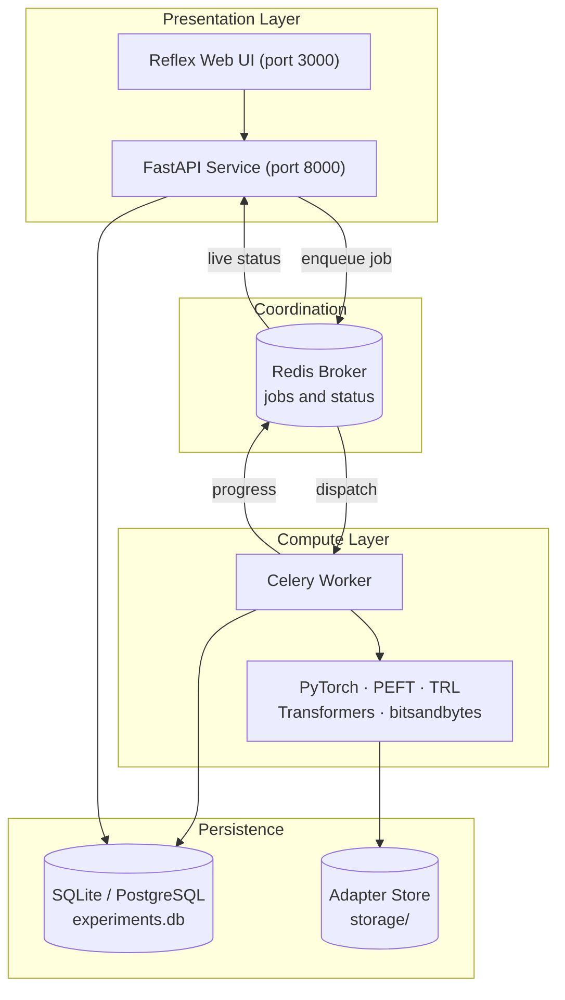
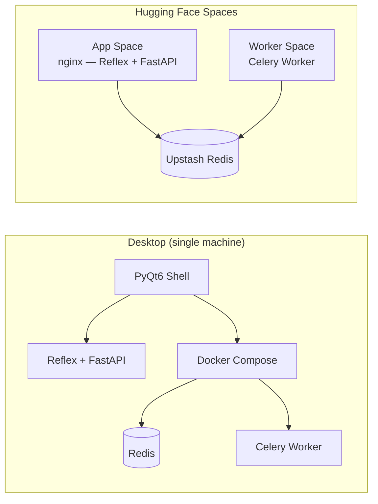
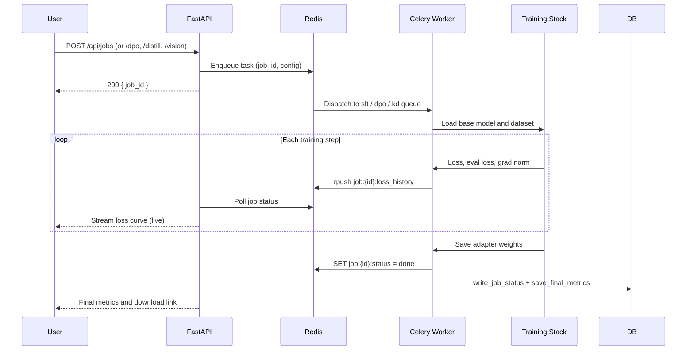
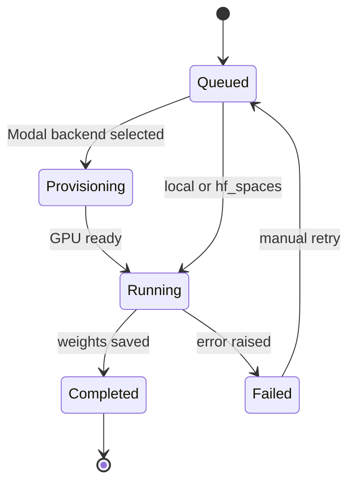

# Architecture

TuneOS is built around a clear separation between the user interface and the compute
layer. The UI submits training jobs to a Redis-backed queue; a Celery worker picks them
up and runs the full training stack. That separation works the same way whether TuneOS
is running on a laptop or deployed across two Hugging Face Spaces.

---

## High-Level Design



---

## Deployment Topologies

TuneOS ships from one codebase but runs in two configurations.



On the desktop, the PyQt6 shell manages the lifecycle of Reflex, FastAPI, Redis, and the
Celery worker through Docker Compose.

In the cloud, the App Space and Worker Space are deployed independently and share an
external Upstash Redis instance. Hugging Face Spaces expose only a single port and
cannot share a local broker, so an external broker is required.

---

## Training Job Lifecycle

When a user submits a fine-tuning job, this is the path it takes:



### Job State Machine



---

## Celery Queue Routing

Jobs are dispatched to named queues so workers can be scaled independently per training
modality.

| Queue | Worker module | Job type |
|---|---|---|
| `sft` | `workers/train_task.py` | Supervised fine-tuning |
| `dpo` | `workers/dpo_task.py` | Direct Preference Optimization |
| `kd` | `workers/kd_task.py` | Knowledge distillation |
| `sft` (default) | `workers/vision_task.py` | Vision-language model fine-tuning |

To dedicate a worker to a single modality:

```bash
celery -A workers.celery_app worker --queues=dpo --loglevel=info
```

---

## Trainer Modules

| Module | Responsibility |
|---|---|
| `trainer/adapters.py` | `AdapterStrategy` protocol; `REGISTRY` (lora, qlora, adalora, ia3, prefix, prompt); `get_strategy(technique)`; `stack_adapter()` for `PeftMixedModel` composition |
| `trainer/finetune.py` | SFT training pipeline; calls `get_strategy()` for adapter injection |
| `trainer/dpo.py` | DPO training via `trl.DPOTrainer` |
| `trainer/vision_finetune.py` | VLM pipeline (`VisionJobConfig`, `vision_finetune()`); uses `AutoProcessor` for image-text preprocessing |
| `trainer/dataset.py` | `load_and_tokenize()`, `load_preference_pairs()`, `load_multimodal()`, `detect_dataset_type()`, `PROMPT_TEMPLATES` registry |
| `trainer/metrics.py` | Pluggable metric registry: perplexity, rouge1, rouge2, rougeL, bleu, meteor |
| `trainer/evaluate.py` | `evaluate_run()`, `generate_predictions()` (batched) |
| `trainer/config.py` | `ModelConfig`, `LoraConfig`, `TrainingConfig`, `DPOConfig`; `get_target_modules()` auto-detects LoRA targets per architecture |

---

## UI State Hierarchy

The fine-tuning wizard uses a three-level state hierarchy. Each level inherits from its
parent and owns a distinct concern.

```
FinetuneState
    Wizard configuration: steps 1-4 fields, technique, DPO/KD params,
    compose_adapters, overlay_technique, training_mode, step guards.
    Computed vars: is_sft, is_dpo, is_kd.

    TrainingPollerState(FinetuneState)
        Training runtime: start_training() with SFT/DPO/KD routing,
        _poll_job_loop(), eval metric display, test-chat interface.
        rehydrate_from_api() restores in-progress run state on page load.

        DeployState(TrainingPollerState)
            Deploy actions: push_to_hub(), push_to_github(),
            start_merge(), start_gguf_export().
            Active only after training reaches Completed state.
```

**FinetuneState** fields — model_id, dataset config, technique, lora_rank, lora_alpha,
lora_dropout, epochs, batch_size, learning_rate, seed, eval_split_ratio, eval_steps,
prompt_template, packing, compute_backend, training_mode (sft/dpo/kd), dpo_beta,
dpo_max_length, dpo_max_prompt_length, prompt_col, chosen_col, rejected_col,
kd_teacher_model, kd_temperature, kd_alpha, compose_adapters, overlay_technique.

**TrainingPollerState** fields — job_id, job_status, loss_history, eval_loss_history,
grad_norm_history, current_epoch, current_step, final_metrics, test_chat_output.

**DeployState** fields — hub_repo_id, github_repo_url, merge_status, gguf_export_status.

Wizard steps 5-7 are implemented as component files under `app/components/finetune/`
rather than inline in the page module. Step guards on `FinetuneState` prevent advancing
past a step until its required fields are set.

---

## AI Intent Flow

The fine-tuning wizard opens with a three-phase intent collection flow that uses
OpenRouter to personalize the experience.

```
Phase A (Context)  -->  Phase B (Questions)  -->  Phase C (Review)
```

**Phase A** collects project name, description, use case, domain, and task type. On
clicking Continue, `intent_next_phase()` calls the OpenRouter API to generate five
questions tailored to that context. If the call fails, five default questions are used
instead — the user never sees an error.

**Phase B** steps through the questions one at a time. After each answer,
`_update_live_plan()` fires an async call to summarize the plan so far in two or three
sentences. That summary appears in an amber card above the next question. If the API
call fails, the card simply does not appear.

**Phase C** shows the complete intent profile as Markdown and lets the user approve or
go back to edit. The approved text populates `user_intent` and drives synthetic data
generation in step 3.

| Operation | Typical latency | Fallback |
|---|---|---|
| Question generation | 2-5 s | Default 5 questions (instant) |
| Live plan update | 1-2 s | Silent — card not shown |
| Synthetic data (10 samples) | 10-20 s | HuggingFace, then templates |

---

## Persistence

### Redis (ephemeral)

| Key pattern | Content | TTL |
|---|---|---|
| `job:{id}:status` | JSON status blob | 48 h after completion |
| `job:{id}:loss_history` | List of step metric entries | Deleted after flush to SQLite |
| `job:{id}:eval` | Final eval metrics JSON | 48 h |
| `job:{id}:hf_token` | Short-TTL HF token | Consumed atomically by `r.getdel()` |

### SQLite / PostgreSQL (durable)

Set `EXPERIMENTS_DB_URL` to a `postgresql://` DSN to switch to PostgreSQL.
The default is `storage/experiments.db`.

| Table | Purpose |
|---|---|
| `runs` | One row per run: config, final loss/perplexity, status, output path |
| `run_metrics` | Step-level metrics `(run_id, key, value, step, timestamp)` |
| `run_params` | Immutable hyperparameter snapshot `(run_id, key, value)` |
| `registered_models` | Named model registry `(name, run_id, alias, metric_snapshot)` |

All upserts use `ON CONFLICT ... DO UPDATE` syntax compatible with both SQLite 3.24+
and PostgreSQL.

---

## Compute Backends

Each job selects a compute backend independently via `compute_backend` in step 4.

| Backend | Where training runs | Required credentials |
|---|---|---|
| `local` | This Celery worker's device | None |
| `modal` | Free Modal.com T4 GPU | `MODAL_TOKEN_ID` + `MODAL_TOKEN_SECRET` |
| `hf_spaces` | ZeroGPU on a Hugging Face Space | `spaces` package; `@spaces.GPU` decorator |

For Modal: the worker serializes the dataset, runs `trainer.finetune` remotely, and
streams the adapter and eval metrics back to local disk. Loss progress is published to
the shared Redis broker so the loss chart updates live, identical to a local run.
Modal's free tier provides roughly 10-15 T4 hours per month.
